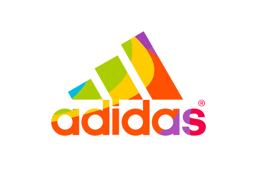
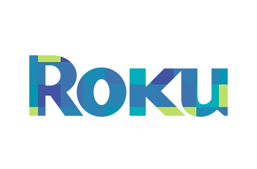
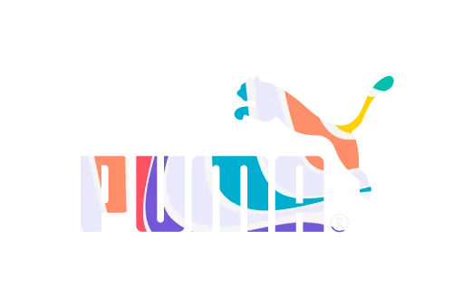

# Clients Carousel - Complete Code Reference

## 📄 HTML Structure

**Location**: `partials/index.clients.partial.html` (NO CHANGES REQUIRED)

```html
<section
  id="clients"
  class="section section--yellow section--pattern-yellow clients"
>
  

  <div class="container clients__inner section__inner">
    <h2 class="clients__title heading">Clients</h2>
    <p class="clients__subtitle">
      I have been fortunate enough to work with 150+ amazing brands to date. You
      will be in good company.
    </p>

    <!-- CAROUSEL CONTAINER -->
    <div class="carousel-clients" aria-label="Clients list">
      <!-- PREV BUTTON -->
      <button
        class="carousel-clients__control carousel-clients__control--prev"
        type="button"
        aria-label="Previous clients"
        data-carousel-prev="clients"
      >
        ‹
      </button>

      <!-- SCROLLABLE TRACK -->
      <div class="carousel-clients__track">
        <!-- ITEMS (repeat for each client) -->
        <article class="carousel-clients__item">
          
        </article>
        <article class="carousel-clients__item">
          
        </article>
        <article class="carousel-clients__item">
          
        </article>
        <article class="carousel-clients__item">
          
        </article>
        <!-- Add more items as needed -->
      </div>

      <!-- NEXT BUTTON -->
      <button
        class="carousel-clients__control carousel-clients__control--next"
        type="button"
        aria-label="Next clients"
        data-carousel-next="clients"
      >
        ›
      </button>
    </div>
  </div>
</section>

<!-- MODAL (auto-generated by JavaScript when first card is clicked) -->
<!-- See modal structure below -->
```

---

## 🎨 CSS Classes

### Carousel Layout

```css
.carousel-clients
├── display: grid
├── grid-template-columns: auto 1fr auto  (button | track | button)
├── gap: 10px
└── align-items: center

.carousel-clients__track
├── display: flex
├── overflow: hidden  (hide items outside bounds)
├── transition: transform 200ms ease  (smooth scroll)
└── transform: translateX(-)  (controlled by JavaScript)

.carousel-clients__item
├── flex-shrink: 0  (prevent shrinking)
├── cursor: pointer  (indicate clickable)
├── background: var(--color-dark)
├── border-radius: var(--radius-sm)
├── min-height: 100px
├── padding: 20px
└── On hover: transform: scale(1.05)

.carousel-clients__control
├── background: transparent
├── border: none
├── font-size: 2rem  (large buttons)
├── cursor: pointer
├── On hover: color: var(--color-accent) yellow
├── When disabled: opacity: 0.5, cursor: not-allowed
└── Attributes: data-carousel-prev/next="clients"
```

### Modal Layout

```css
.modal-clients
├── position: fixed
├── inset: 0  (cover entire viewport)
├── z-index: 80
├── display: none  (hidden by default)
└── display: grid  (when .is-open)

.modal-clients__backdrop
├── position: absolute
├── inset: 0  (cover entire modal)
└── background: var(--overlay-dark-strong) rgba(0,0,0,0.66)

.modal-clients__dialog
├── position: relative
├── z-index: 1  (above backdrop)
├── width: min(92vw, 600px)  (responsive, max 600px)
├── max-height: 80vh
├── border-radius: var(--radius-md)
├── background: var(--color-dark)
├── box-shadow: var(--shadow-md)
├── padding: 24px
└── display: flex, align-items: center, justify-content: center

.modal-clients__content
├── display: flex
├── align-items: center
├── justify-content: center
└── img: max-height: calc(80vh - 48px)

.modal-clients__close
├── position: absolute
├── top: 8px, right: 12px
├── width/height: 34px (aspect-ratio: 1)
├── border-radius: 50%  (circle)
├── background: var(--overlay-dark-soft) rgba(0,0,0,0.3)
├── border: none
├── cursor: pointer
└── On hover: background: var(--overlay-white-soft)
```

---

## 🔧 JavaScript (Complete Implementation)

**File**: `js/carousel-clients.js`

```javascript
/**
 * Clients Carousel with Modal
 * - Responsive: 1 card on mobile (<992px), 4 cards on desktop (>=992px)
 * - Navigate with prev/next buttons
 * - Click card to open in modal
 * - Close modal with close button, backdrop click, or Escape key
 */

class ClientsCarousel {
  constructor() {
    // DOM Elements
    this.track = document.querySelector(".carousel-clients__track");
    this.items = document.querySelectorAll(".carousel-clients__item");
    this.prevBtn = document.querySelector("[data-carousel-prev='clients']");
    this.nextBtn = document.querySelector("[data-carousel-next='clients']");
    this.carouselContainer = document.querySelector(".carousel-clients");

    // Safety check
    if (!this.track || this.items.length === 0) {
      console.warn("Clients carousel not found or empty");
      return;
    }

    // State
    this.currentIndex = 0;
    this.visibleCount = this.getVisibleCount();
    this.itemWidth = 0;

    this.init();
  }

  /**
   * Initialize carousel
   */
  init() {
    this.setupEventListeners();
    this.calculateLayout();
    this.render();
    this.setupCardClickModal();
    window.addEventListener("resize", () => this.handleResize());
  }

  /**
   * Setup button click listeners
   */
  setupEventListeners() {
    if (this.prevBtn) {
      this.prevBtn.addEventListener("click", () => this.prev());
    }
    if (this.nextBtn) {
      this.nextBtn.addEventListener("click", () => this.next());
    }
  }

  /**
   * Get number of visible cards based on viewport width
   * @returns {number} 1 for mobile (<992px), 4 for desktop (>=992px)
   */
  getVisibleCount() {
    return window.innerWidth >= 992 ? 4 : 1;
  }

  /**
   * Calculate layout dimensions and apply to items
   */
  calculateLayout() {
    this.visibleCount = this.getVisibleCount();

    // Calculate item width based on container
    const containerWidth = this.carouselContainer.offsetWidth;
    // Account for button widths (2rem each) and gaps (10px each)
    const totalButtonAndGapWidth = 2 * 32 + 2 * 10;
    const availableWidth = containerWidth - totalButtonAndGapWidth;
    this.itemWidth = availableWidth / this.visibleCount;

    // Apply width to all items
    this.items.forEach((item) => {
      item.style.width = this.itemWidth + "px";
    });

    // Validate current index doesn't exceed bounds
    const maxIndex = Math.max(0, this.items.length - this.visibleCount);
    this.currentIndex = Math.min(this.currentIndex, maxIndex);
  }

  /**
   * Update carousel position and button states
   */
  render() {
    // Move track
    const scrollDistance = this.currentIndex * this.itemWidth;
    this.track.style.transform = `translateX(-${scrollDistance}px)`;

    // Update buttons
    this.updateButtonStates();
  }

  /**
   * Enable/disable navigation buttons based on position
   */
  updateButtonStates() {
    const maxIndex = Math.max(0, this.items.length - this.visibleCount);

    if (this.prevBtn) {
      this.prevBtn.disabled = this.currentIndex === 0;
      this.prevBtn.setAttribute("aria-disabled", this.currentIndex === 0);
    }

    if (this.nextBtn) {
      this.nextBtn.disabled = this.currentIndex >= maxIndex;
      this.nextBtn.setAttribute("aria-disabled", this.currentIndex >= maxIndex);
    }
  }

  /**
   * Navigate to previous cards
   */
  prev() {
    if (this.currentIndex > 0) {
      this.currentIndex--;
      this.render();
    }
  }

  /**
   * Navigate to next cards
   */
  next() {
    const maxIndex = Math.max(0, this.items.length - this.visibleCount);
    if (this.currentIndex < maxIndex) {
      this.currentIndex++;
      this.render();
    }
  }

  /**
   * Handle window resize - recalculate layout
   */
  handleResize() {
    const oldVisibleCount = this.visibleCount;
    this.calculateLayout();

    // Only re-render if visible count changed
    if (oldVisibleCount !== this.visibleCount) {
      this.render();
    }
  }

  /**
   * Setup card click event listener
   * Uses event delegation on the track
   */
  setupCardClickModal() {
    this.track.addEventListener("click", (e) => {
      const item = e.target.closest(".carousel-clients__item");
      if (item) {
        const img = item.querySelector("img");
        if (img) {
          this.openModal(img);
        }
      }
    });
  }

  /**
   * Open modal with image
   * @param {HTMLImageElement} imgElement - Image to display
   */
  openModal(imgElement) {
    // Create modal structure if doesn't exist
    let modal = document.getElementById("modal-clients");

    if (!modal) {
      modal = document.createElement("div");
      modal.id = "modal-clients";
      modal.className = "modal-clients";
      modal.innerHTML = `
        <div class="modal-clients__backdrop"></div>
        <div class="modal-clients__dialog" role="dialog" aria-label="Client logo">
          <button class="modal-clients__close" aria-label="Close modal" type="button">
            ✕
          </button>
          <div class="modal-clients__content"></div>
        </div>
      `;
      document.body.appendChild(modal);

      // Setup close handlers
      const closeBtn = modal.querySelector(".modal-clients__close");
      const backdrop = modal.querySelector(".modal-clients__backdrop");

      closeBtn.addEventListener("click", () => this.closeModal());
      backdrop.addEventListener("click", () => this.closeModal());

      // Escape key listener
      document.addEventListener("keydown", (e) => {
        if (e.key === "Escape" && modal.classList.contains("is-open")) {
          this.closeModal();
        }
      });
    }

    // Update modal content
    const contentContainer = modal.querySelector(".modal-clients__content");
    contentContainer.innerHTML = "";

    // Clone image for modal display
    const clonedImg = imgElement.cloneNode(true);
    clonedImg.style.width = "auto";
    clonedImg.style.maxWidth = "100%";
    clonedImg.style.height = "auto";

    contentContainer.appendChild(clonedImg);

    // Show modal
    modal.classList.add("is-open");
    document.body.style.overflow = "hidden";
  }

  /**
   * Close modal
   */
  closeModal() {
    const modal = document.getElementById("modal-clients");
    if (modal) {
      modal.classList.remove("is-open");
      document.body.style.overflow = "";
    }
  }
}

// Initialize on DOM ready
document.addEventListener("DOMContentLoaded", () => {
  new ClientsCarousel();
});
```

---

## 🎯 Flow Diagram

### Carousel Navigation Flow

```
User clicks "Next" button
         ↓
nextBtn click event → next() method
         ↓
Check if currentIndex < maxIndex
         ↓
currentIndex++
         ↓
render() called
         ↓
Calculate scrollDistance = currentIndex * itemWidth
         ↓
Apply: track.style.transform = `translateX(-${scrollDistance}px)`
         ↓
CSS transition animates the movement (200ms)
         ↓
updateButtonStates() enables/disables buttons
         ↓
User sees smooth carousel movement
```

### Modal Flow

```
User clicks card logo
         ↓
setupCardClickModal() listener triggered
         ↓
event.target.closest(".carousel-clients__item") finds item
         ↓
Query image from item
         ↓
openModal(imgElement) called
         ↓
If modal doesn't exist: Create and inject into DOM
         ↓
Set up close listeners (button, backdrop, Escape)
         ↓
Clone image for display
         ↓
Add "is-open" class
         ↓
Modal appears with fade-in via CSS
         ↓
User sees logo in centered modal
         ↓
User clicks close button/backdrop/presses Escape
         ↓
closeModal() removes "is-open" class
         ↓
Modal disappears
```

---

## 🔄 Responsive Behavior

### At 992px Breakpoint

```javascript
getVisibleCount() {
  // Below 992px: 1 card visible
  // At/above 992px: 4 cards visible
  return window.innerWidth >= 992 ? 4 : 1;
}
```

### Layout Recalculation on Resize

```javascript
handleResize() {
  const oldCount = this.visibleCount;
  this.calculateLayout(); // Recalculate with new window width

  if (oldCount !== this.visibleCount) {
    // Visible count changed, update carousel
    this.render();
  }
}
```

---

## 📊 State Management

```javascript
this.currentIndex = 0; // Current scroll position (0-indexed)
this.visibleCount = 1 / 4; // Number of visible items
this.itemWidth = calculated; // Width of each item in pixels
this.items = NodeList; // All .carousel-clients__item elements
this.track = Element; // .carousel-clients__track element
this.prevBtn = Element; // [data-carousel-prev="clients"]
this.nextBtn = Element; // [data-carousel-next="clients"]
```

---

## ✨ CSS Animation Details

```css
/* Smooth scroll animation */
.carousel-clients__track {
  transition: transform 200ms ease; /* transform-only animation */
  /* Using transform for 60fps performance (GPU accelerated) */
}

/* Hover effect on cards */
.carousel-clients__item:hover {
  transform: scale(1.05); /* 5% scale up */
  transition: transform 200ms ease;
}

/* Button hover effect */
.carousel-clients__control:hover:not(:disabled) {
  color: var(--color-accent); /* Yellow highlight */
  /* Uses color property for better performance */
}
```

---

## 🔐 Accessibility Features

```html
<!-- Button labels -->
<button aria-label="Previous clients">‹</button>
<button aria-label="Next clients">›</button>

<!-- Container label -->
<div class="carousel-clients" aria-label="Clients list">
  <!-- Modal dialog role -->
  <div role="dialog" aria-label="Client logo">
    <!-- Close button -->
    <button class="modal-clients__close" aria-label="Close modal">✕</button>

    <!-- Dynamic disabled state -->
    <button disabled aria-disabled="true"></button>
  </div>
</div>
```

---

## 🧪 Testing Code Snippets

**Test in browser console**:

```javascript
// Access carousel instance (if global)
// Get current state
document.querySelector(".carousel-clients__track").style.transform;
// Should show: "translateX(-0px)" or similar

// Get visible count
window.innerWidth >= 992 ? "4 cards" : "1 card";

// Manually trigger navigation
const prevBtn = document.querySelector("[data-carousel-prev='clients']");
prevBtn.click(); // Moves carousel

// Check modal existence
document.getElementById("modal-clients"); // null before first click, Element after

// Open modal programmatically
const item = document.querySelector(".carousel-clients__item");
const img = item.querySelector("img");
// Click the item to trigger modal
item.click();
```

---

## 🎉 That's Everything!

All code is production-ready. No dependencies, pure vanilla JavaScript and CSS.
