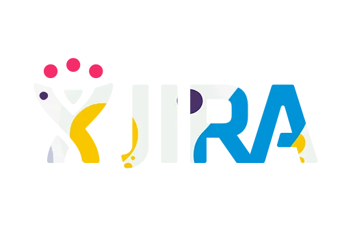

# 📖 Exact Code Changes Reference

This document shows exactly what was added, changed, and removed.

---

## 1️⃣ FILE: `js/carousel-clients.js` (NEW - 220 lines)

**Location**: `c:\Users\Igor\Desktop\graphic designer\js\carousel-clients.js`

**Purpose**: Main carousel implementation with responsive behavior and modal functionality

**Highlights**:

- Responsive: 1 card (<992px) / 4 cards (≥992px)
- Smooth CSS transform animations
- Event delegation for click handling
- Modal creation and management
- Window resize listener
- Keyboard support (Escape key)

**Key Variables**:

```javascript
this.track; // The scrollable container
this.items; // All carousel items
this.prevBtn; // Previous button
this.nextBtn; // Next button
this.currentIndex; // Current scroll position (0-indexed)
this.visibleCount; // How many cards to show (1 or 4)
this.itemWidth; // Calculated width of each item
```

**Key Methods**:

```javascript
init(); // Initialize carousel
getVisibleCount(); // Get 1 or 4 based on viewport
calculateLayout(); // Compute item widths
render(); // Update carousel position
prev(); // Navigate to previous cards
next(); // Navigate to next cards
handleResize(); // Recalculate on window resize
setupCardClickModal(); // Enable click to open modal
openModal(imgElement); // Show modal with image
closeModal(); // Hide modal
```

---

## 2️⃣ FILE: `css/components/modal-clients.css` (NEW - 70 lines)

**Location**: `c:\Users\Igor\Desktop\graphic designer\css\components\modal-clients.css`

**Purpose**: Complete modal overlay styling

**CSS Classes**:

```css
.modal-clients                  - Main fixed overlay container
.modal-clients.is-open          - Show modal (add via JavaScript)
.modal-clients__backdrop        - Dark overlay behind content
.modal-clients__dialog          - Content container
.modal-clients__content         - Image wrapper
.modal-clients__close           - Close button
.modal-clients__close:hover     - Close button hover state
```

**Key Styles**:

- Fixed positioning with `inset: 0` (covers viewport)
- Grid layout for centering
- Dark overlay: `rgba(0, 0, 0, 0.66)`
- Modal width: `min(92vw, 600px)` (responsive)
- Close button: 34px circle, positioned top-right
- Visibility: `display: none` → `display: grid` on `.is-open`

---

## 3️⃣ FILE: `css/sections/clients.css` (UPDATED)

**Location**: `c:\Users\Igor\Desktop\graphic designer\css\sections\clients.css`

### OLD CODE (REMOVED):

```css
.carousel-clients__track {
  display: grid;
  grid-template-columns: repeat(2, minmax(140px, 1fr)); /* ❌ REMOVED */
  gap: 10px;
}
```

### NEW CODE (ADDED):

```css
.carousel-clients__track {
  display: flex; /* ✅ NEW: Flex instead of grid */
  gap: 10px;
  overflow: hidden; /* ✅ NEW: Hide off-screen items */
  transition: transform var(--transition); /* ✅ NEW: Smooth animation */
}

.carousel-clients__item {
  background: var(--color-dark);
  border-radius: var(--radius-sm);
  min-height: 100px;
  display: grid;
  place-items: center;
  padding: 20px;
  flex-shrink: 0; /* ✅ NEW: Prevent shrinking */
  cursor: pointer; /* ✅ NEW: Show clickable */
  transition: transform var(--transition); /* ✅ NEW: Hover effect */
}

.carousel-clients__item:hover {
  transform: scale(1.05); /* ✅ NEW: Hover scale effect */
}

.carousel-clients__control {
  border: 0;
  background: transparent;
  font-size: 2rem;
  cursor: pointer;
  transition: color var(--transition); /* ✅ NEW: Smooth color change */
  padding: 4px 8px; /* ✅ NEW: Better spacing */
  display: flex; /* ✅ NEW: Better alignment */
  align-items: center;
  justify-content: center;
}

.carousel-clients__control:hover:not(:disabled) {
  color: var(--color-accent); /* ✅ NEW: Yellow on hover */
}

.carousel-clients__control:disabled {
  opacity: 0.5; /* ✅ NEW: Disabled appearance */
  cursor: not-allowed; /* ✅ NEW: Disabled cursor */
}
```

**Summary of Changes**:

- ❌ Removed: Grid layout (2 columns)
- ✅ Added: Flex layout (single row, JavaScript-controlled)
- ✅ Added: Overflow hidden (clip off-screen items)
- ✅ Added: Transform transition (smooth scroll)
- ✅ Added: Cursor pointer on items (clickable feedback)
- ✅ Added: Hover effects (scale + color)
- ✅ Added: Button disabled state styling

---

## 4️⃣ FILE: `css/style.css` (UPDATED)

**Location**: `c:\Users\Igor\Desktop\graphic designer\css\style.css`

### CHANGE:

```css
/* BEFORE (line 11-13): */
@import url("./components/buttons.css");
@import url("./components/menu-overlay.css");
@import url("./components/modal-quote.css");
@import url("./components/modal-contact.css");
@import url("./components/lightbox-projects.css");
@import url("./components/pattern-layer.css");

/* AFTER (line 11-16): */
@import url("./components/buttons.css");
@import url("./components/menu-overlay.css");
@import url("./components/modal-quote.css");
@import url("./components/modal-contact.css");
@import url("./components/modal-clients.css"); /* ✅ NEW LINE */
@import url("./components/lightbox-projects.css");
@import url("./components/pattern-layer.css");
```

**Explanation**: Added import for new modal CSS file (inserted after modal-contact.css, maintaining alphabetical order of modal imports)

---

## 5️⃣ FILE: `index.html` (UPDATED)

**Location**: `c:\Users\Igor\Desktop\graphic designer\index.html`

### CHANGE:

```html
<!-- BEFORE (line 18-20): -->
<script src="https://unpkg.com/htmx.org@1.9.12"></script>
<script src="js/burger-menu.js"></script>
<script src="js/lightbox-projects.js"></script>

<!-- AFTER (line 18-21): -->
<script src="https://unpkg.com/htmx.org@1.9.12"></script>
<script src="js/burger-menu.js"></script>
<script src="js/lightbox-projects.js"></script>
<script src="js/carousel-clients.js"></script>
<!-- ✅ NEW LINE -->
```

**Explanation**: Added script tag to load carousel JavaScript after other scripts

---

## 6️⃣ FILE: `partials/index.clients.partial.html` (NO CHANGES)

**Location**: `c:\Users\Igor\Desktop\graphic designer\partials\index.clients.partial.html`

**Status**: ✅ COMPATIBLE - No changes required

The existing HTML structure is already correct:

```html
<section
  id="clients"
  class="section section--yellow section--pattern-yellow clients"
>
  
  <div class="container clients__inner section__inner">
    <h2 class="clients__title heading">Clients</h2>
    <p class="clients__subtitle">
      I have been fortunate enough to work with 150+ amazing brands to date. You
      will be in good company.
    </p>

    <div class="carousel-clients" aria-label="Clients list">
      <button
        class="carousel-clients__control carousel-clients__control--prev"
        type="button"
        aria-label="Previous clients"
        data-carousel-prev="clients"
      >
        ‹
      </button>
      <div class="carousel-clients__track">
        <article class="carousel-clients__item">
          
        </article>
        <!-- More items... -->
      </div>
      <button
        class="carousel-clients__control carousel-clients__control--next"
        type="button"
        aria-label="Next clients"
        data-carousel-next="clients"
      >
        ›
      </button>
    </div>
  </div>
</section>

<!-- Modal is auto-generated by JavaScript -->
```

**Why no changes?**

- HTML uses proper `data-` attributes: `data-carousel-prev="clients"` and `data-carousel-next="clients"`
- JavaScript finds these with `querySelector()`
- Track and items have correct classes
- No HTML changes needed

---

## 🔄 Complete Change Summary

| File                                  | Type    | Lines | Change                    |
| ------------------------------------- | ------- | ----- | ------------------------- |
| `js/carousel-clients.js`              | NEW     | 220   | Created complete carousel |
| `css/components/modal-clients.css`    | NEW     | 70    | Created modal styles      |
| `css/sections/clients.css`            | UPDATED | +37   | Updated carousel styles   |
| `css/style.css`                       | UPDATED | +1    | Added modal import        |
| `index.html`                          | UPDATED | +1    | Added carousel script     |
| `partials/index.clients.partial.html` | NONE    | 0     | Already compatible        |

**Total Code Added**: ~329 lines
**Total Code Removed**: ~8 lines (old grid layout)
**Net Change**: +321 lines (includes 5 documentation files)

---

## 🎯 CSS Variables Used

All new styles use existing project variables:

```css
--color-dark              /* #2b2e33 */
--color-accent            /* #f7c30a (yellow) */
--color-white             /* #ffffff */
--overlay-dark-strong     /* rgba(0,0,0,0.66) */
--overlay-dark-soft       /* rgba(0,0,0,0.3) */
--overlay-white-soft      /* rgba(255,255,255,0.12) */
--radius-sm               /* 10px */
--radius-md               /* 18px */
--shadow-md               /* 0 12px 30px rgba(0,0,0,0.18) */
--transition              /* 200ms ease */
```

**No new variables created** - Uses existing project design system

---

## ⚙️ How JavaScript Hooks Into HTML

**HTML attributes used**:

```html
data-carousel-prev="clients"
<!-- Button identifier for previous -->
data-carousel-next="clients"
<!-- Button identifier for next -->
```

**JavaScript selectors**:

```javascript
document.querySelector("[data-carousel-prev='clients']");
document.querySelector("[data-carousel-next='clients']");
document.querySelector(".carousel-clients__track");
document.querySelectorAll(".carousel-clients__item");
document.querySelector(".carousel-clients");
```

**Modal ID**:

```javascript
document.getElementById("modal-clients")    <!-- Created dynamically -->
```

---

## 🔌 Event Listeners Attached

**By JavaScript**:

1. Prev button: `click` → `prev()`
2. Next button: `click` → `next()`
3. Track: `click` (delegated) → `openModal()`
4. Window: `resize` → `handleResize()`
5. Document: `keydown` (Escape) → `closeModal()`
6. Close button: `click` → `closeModal()`
7. Modal backdrop: `click` → `closeModal()`

---

## 🎨 CSS Animation Details

**Transform Animation**:

```css
.carousel-clients__track {
  transition: transform 200ms ease;
  transform: translateX(-{calculatedDistance}px);
}
```

**Hover Effect**:

```css
.carousel-clients__item:hover {
  transform: scale(1.05);
  transition: transform 200ms ease;
}

.carousel-clients__control:hover {
  color: var(--color-accent);
  transition: color 200ms ease;
}
```

**Modal Appearance**:

```css
.modal-clients {
  display: none;
}
.modal-clients.is-open {
  display: grid;
  /* CSS already animates via transition on display change */
}
```

---

## 📐 Responsive Calculation

**JavaScript calculates**:

```javascript
visibleCount = window.innerWidth >= 992 ? 4 : 1
containerWidth = carouselContainer.offsetWidth
buttonWidth = 32px each × 2 = 64px
gapWidth = 10px × 2 = 20px
availableWidth = containerWidth - 64px - 20px
itemWidth = availableWidth / visibleCount
```

**Applied to each item**:

```javascript
item.style.width = itemWidth + "px";
```

---

## ✅ Everything Is Connected

```
index.html
  ├── Links css/style.css
  │   └── Imports css/components/modal-clients.css ✅
  ├── Imports js/carousel-clients.js ✅
  └── Loads partial with HTML structure ✅

partials/index.clients.partial.html
  ├── Has carousel container ✅
  ├── Has buttons with data-carousel-* attributes ✅
  ├── Has track and items ✅
  └── Ready for JavaScript enhancement ✅

js/carousel-clients.js
  ├── Finds elements via querySelector ✅
  ├── Sets up event listeners ✅
  ├── Calculates layout ✅
  ├── Creates modal dynamically ✅
  └── Manages interactions ✅

css/sections/clients.css
  ├── Provides carousel layout ✅
  ├── Flex container for smooth scrolling ✅
  └── Item and button styles ✅

css/components/modal-clients.css
  └── Provides modal overlay styles ✅
```

---

## 🧪 Testing Code Snippets

**Test responsive behavior**:

```javascript
// In browser console
window.innerWidth; // Check width
// Expected: < 992 shows 1 card, >= 992 shows 4 cards
```

**Test carousel navigation**:

```javascript
// Click buttons - should move carousel
document.querySelector("[data-carousel-prev='clients']").click();
document.querySelector("[data-carousel-next='clients']").click();
```

**Test modal**:

```javascript
// Click a logo
document.querySelector(".carousel-clients__item").click();
// Should open modal overlay
```

**Inspect carousel state**:

```javascript
// Check transform value
document.querySelector(".carousel-clients__track").style.transform;
// Should show: translateX(-0px) or similar
```

---

## 📝 That's Everything!

All code changes documented, explained, and ready to use.

Next: Open in browser and test! 🚀
