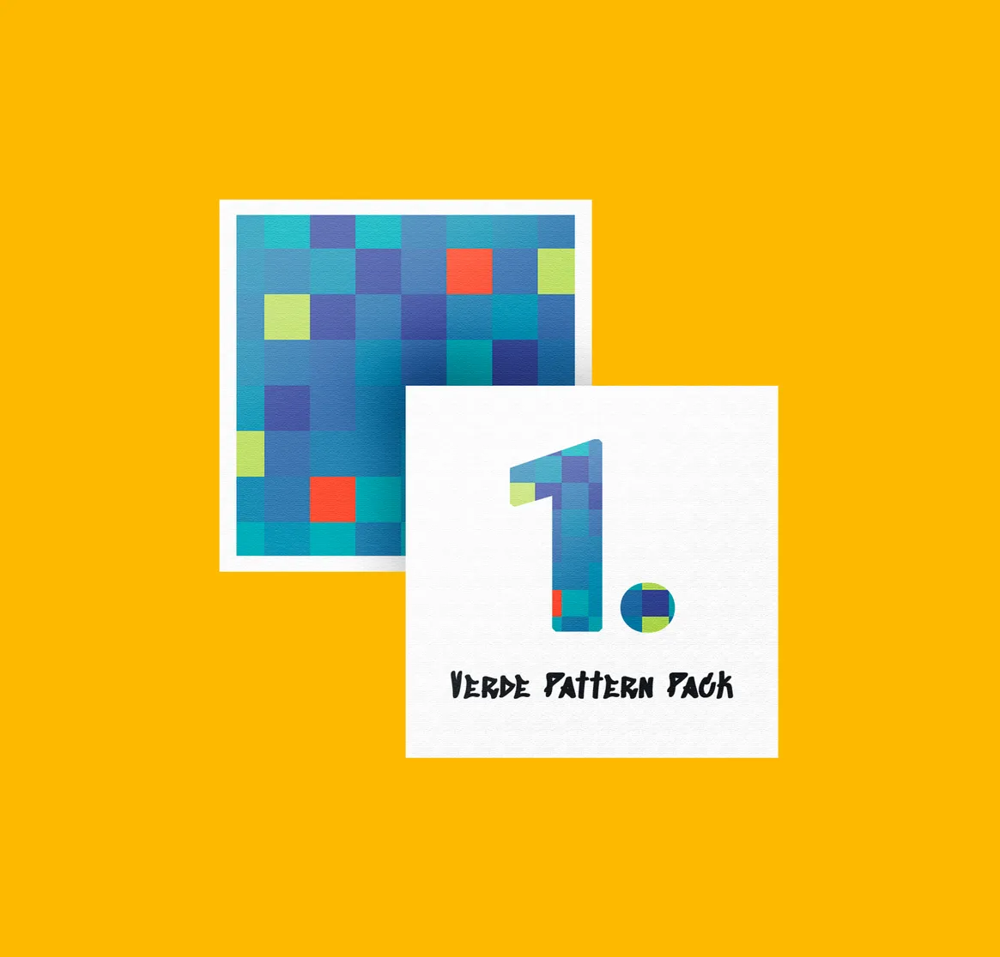
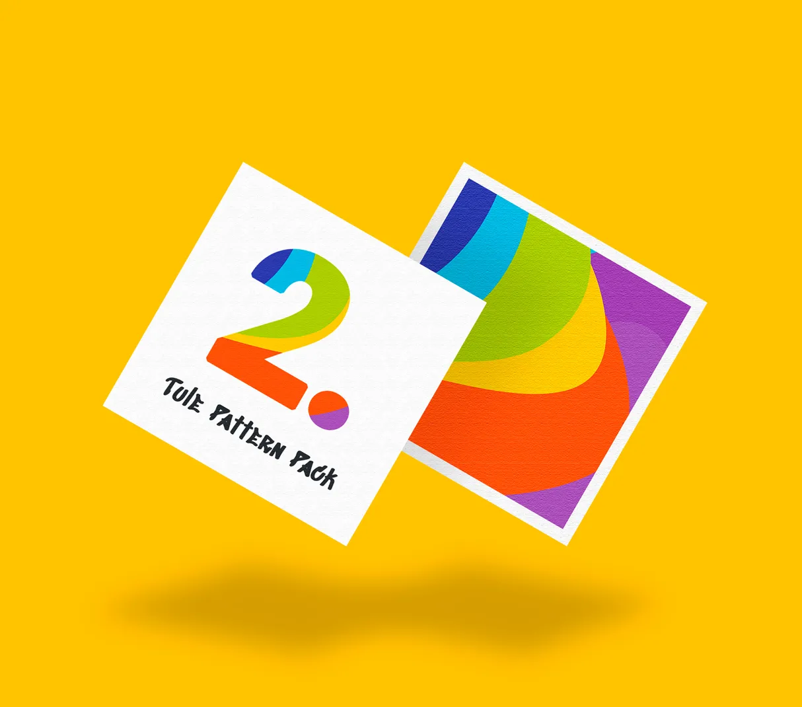
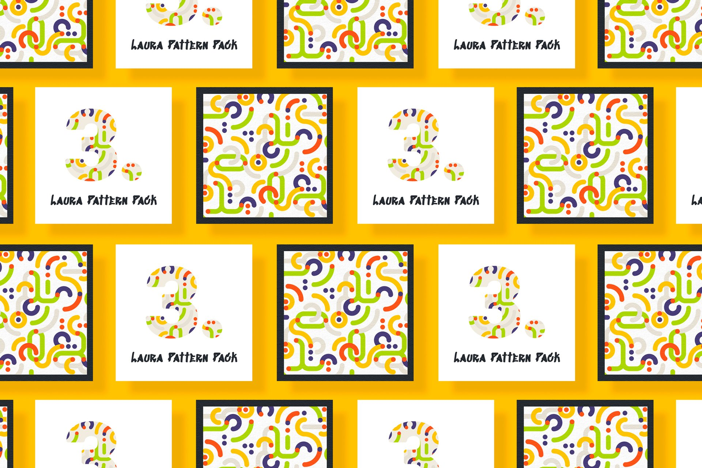
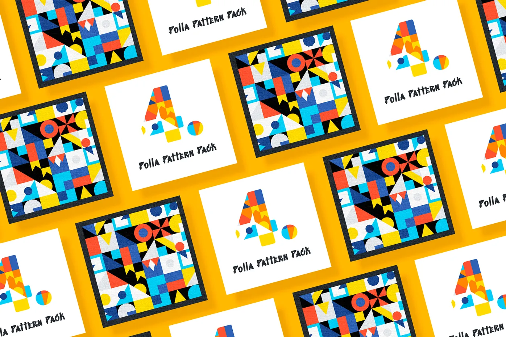
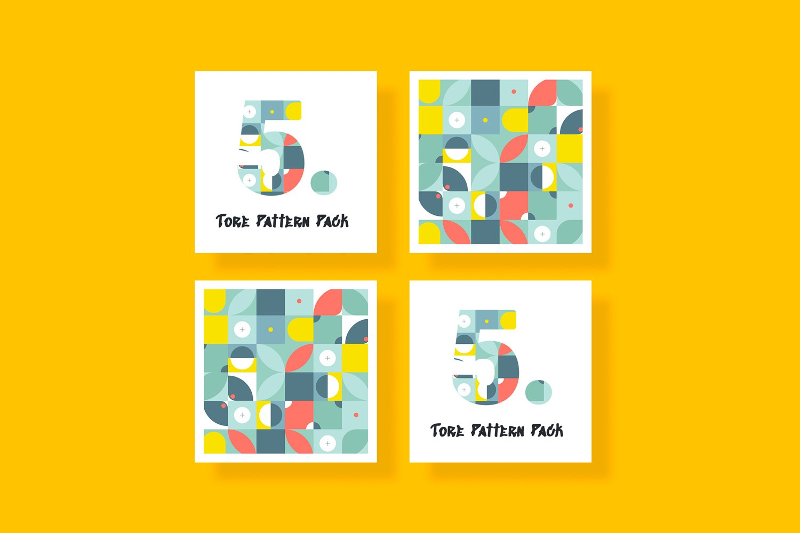
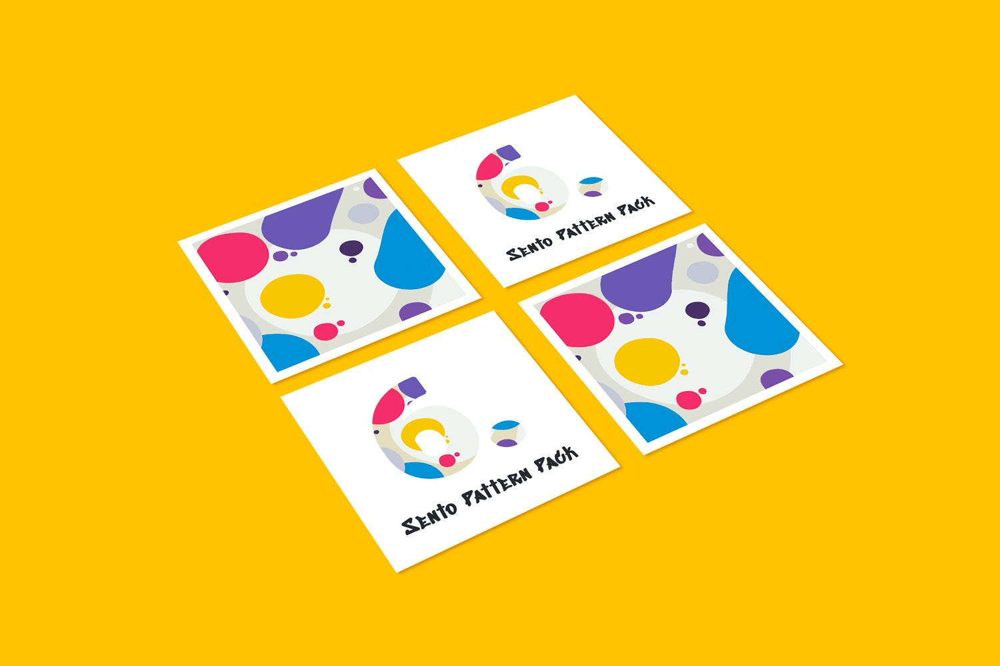

# Lightbox Gallery - Implementation Summary

## Quick Reference

### 1. HTML Structure (index.latest-projects.partial.html)

```html
<section class="latest-projects">
  <div class="container latest-projects__inner section__inner">
    <h2 class="latest-projects__title heading">Latest Projects</h2>

    <p class="latest-projects__subtitle">
      Here are some of the latest projects for my clients. They include banners,
      printed materials, etc.
    </p>

    <div class="latest-projects__grid" data-projects-gallery>
      <a href="#" class="projects__link" data-project-open>
        
      </a>
      <a href="#" class="projects__link" data-project-open>
        
      </a>
      <a href="#" class="projects__link" data-project-open>
        
      </a>
      <a href="#" class="projects__link" data-project-open>
        
      </a>
      <a href="#" class="projects__link" data-project-open>
        
      </a>
      <a href="#" class="projects__link" data-project-open>
        
      </a>
    </div>
  </div>
</section>
```

**Key Changes from Old System:**

- Grid container has `data-projects-gallery` attribute
- Each link has `data-project-open` attribute
- `href` changed from `#project-1` to `#` (prevents navigation)
- No modal HTML needed in the markup

---

### 2. CSS Import (css/style.css)

**Remove:**

```css
@import url("./components/modal-project.css");
```

**Add:**

```css
@import url("./components/lightbox-projects.css");
```

---

### 3. Script Tag (index.html)

Add before closing `</head>` or after burger-menu.js:

```html
<script src="js/lightbox-projects.js"></script>
```

---

### 4. JavaScript Class Architecture (js/lightbox-projects.js)

Key methods:

```javascript
class ProjectsLightbox {
  init()           // Initialize gallery and create lightbox
  open()           // Open lightbox with current image
  close()          // Close lightbox
  next()           // Show next image
  previous()       // Show previous image
  updateImage()    // Update displayed image and counter
}

// Auto-initializes on page load
new ProjectsLightbox();
```

**Event Flow:**

1. User clicks project image → `handleGalleryClick()`
2. Set current index → `open()`
3. User clicks arrow/keyboard → `next()` or `previous()`
4. Update image → `updateImage()`
5. User presses Escape/clicks close → `close()`

---

### 5. CSS Structure (css/components/lightbox-projects.css)

**Main Classes:**

```css
.lightbox-projects                    /* Hidden container */
  .lightbox-projects--active          /* Visible state */
  .lightbox-projects__backdrop        /* Dark overlay */
  .lightbox-projects__container       /* Flex container */
  .lightbox-projects__content         /* Image wrapper */
  .lightbox-projects__image           /* The actual image */
  .lightbox-projects__close           /* Close button */
  .lightbox-projects__nav             /* Navigation buttons */
  .lightbox-projects__nav--prev       /* Left arrow */
  .lightbox-projects__nav--next       /* Right arrow */
  .lightbox-projects__counter         /* Image counter */
```

---

## Features & Keyboard Shortcuts

| Action   | Method       | Trigger                                          |
| -------- | ------------ | ------------------------------------------------ |
| Open     | `open()`     | Click image                                      |
| Close    | `close()`    | Escape key / Click close button / Click backdrop |
| Next     | `next()`     | Click right arrow / ArrowRight key               |
| Previous | `previous()` | Click left arrow / ArrowLeft key                 |

---

## Data Attributes Used

| Attribute                | Element          | Purpose                                     |
| ------------------------ | ---------------- | ------------------------------------------- |
| `data-projects-gallery`  | Grid container   | Marks the gallery for event delegation      |
| `data-project-open`      | Project links    | Identifies clickable project items          |
| `data-lightbox-projects` | Lightbox wrapper | Identifies the dynamically created lightbox |

---

## CSS Customization Points

**Dark Backdrop Transparency:**

```css
.lightbox-projects__backdrop {
  background-color: rgba(0, 0, 0, 0.85); /* Change 0.85 */
}
```

**Button Hover Colors:**

```css
.lightbox-projects__close:hover,
.lightbox-projects__nav:hover {
  color: var(--color-yellow); /* Change to your color */
}
```

**Animation Speed:**

```css
@keyframes lightbox-fade-in {
  /* ... */
  animation: lightbox-fade-in 0.3s ease-out; /* Change 0.3s */
}
```

---

## Responsive Breakpoint

Media query adjusts UI at 600px and below:

- Smaller buttons
- Reduced padding
- Adjusted positioning

---

## Files Summary

| File                                          | Status        | Purpose                            |
| --------------------------------------------- | ------------- | ---------------------------------- |
| `js/lightbox-projects.js`                     | ✅ Created    | Main JavaScript logic              |
| `css/components/lightbox-projects.css`        | ✅ Created    | Lightbox styles                    |
| `css/style.css`                               | ✅ Updated    | Import new CSS, remove old         |
| `index.html`                                  | ✅ Updated    | Added script tag                   |
| `partials/index.latest-projects.partial.html` | ✅ Updated    | Added data attributes, fixed hrefs |
| `css/components/modal-project.css`            | ❌ Deprecated | No longer used                     |

---

## Testing Checklist

- [ ] Click a project image → lightbox opens
- [ ] Click close button (✕) → lightbox closes
- [ ] Click dark backdrop → lightbox closes
- [ ] Click left arrow → shows previous image
- [ ] Click right arrow → shows next image
- [ ] Press Escape → lightbox closes
- [ ] Press ArrowLeft → shows previous image
- [ ] Press ArrowRight → shows next image
- [ ] Image counter updates correctly
- [ ] No page scroll while lightbox is open
- [ ] No console errors
- [ ] Works on mobile (responsive)
- [ ] Grid layout unchanged

---

## Technical Details

**Prevents Page Navigation:**

```javascript
projectLink.addEventListener("click", (e) => {
  e.preventDefault(); // Stops default link behavior
  this.open();
});
```

**Prevents Body Scroll:**

```javascript
document.documentElement.style.overflow = "hidden";
document.body.style.overflow = "hidden";
```

**Event Delegation:**

```javascript
this.gallery.addEventListener("click", (e) => {
  const projectLink = e.target.closest("[data-project-open]");
  // Single listener handles all project clicks
});
```

**Dynamic Element Creation:**

```javascript
const lightbox = document.createElement("div");
lightbox.className = "lightbox-projects";
lightbox.innerHTML = `...`;
document.body.appendChild(lightbox);
```

---

## No External Dependencies

- Pure vanilla JavaScript
- CSS with standard properties
- Works with vanilla HTML
- Compatible with HTMX (used in your project)
- IE11+ (uses ES6 syntax, no older browser support)

---

## Migration from Old System

### Old System (CSS :target modals)

```html
<!-- Old modal HTML in partials/global.modals.partial.html -->
<div id="project-1" class="modal-project">...</div>

<!-- Old link behavior -->
<a href="#project-1" class="projects__link">
  
</a>
```

### New System (JavaScript lightbox)

```html
<!-- No separate modal HTML needed -->

<!-- New link behavior -->
<a href="#" class="projects__link" data-project-open>
  
</a>
```

The lightbox is now generated entirely in JavaScript and injected into the DOM once.
